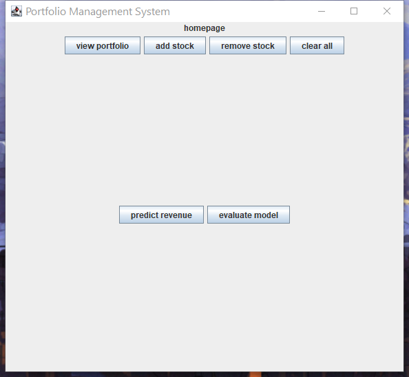

# CSC207 Projectum

**Financial Assets Portfolio Management System and Revenue Prediction with Model Performance Tracking**

## Table of Contents
- [Project Purpose](#project-purpose)
- [Features](#features)
- [Example Usage](#example-usage)
- [Installation Instructions](#installation-instructions)
- [Feedback](#feedback)
- [Future Contributions](#future-contributions)
- [Tutorial Usage](#tutorial-usage)
- [Contributors](#contributors)

## Project Purpose

This project is designed for individuals with a basic understanding of various statistical models used in the stock market who wish to track and evaluate the performance of these models. It serves as a practical template for users to test and assess their own models in a real-world context.

Created by a team passionate about finance and economics, this tool showcases our skills and contributes a valuable resource to others with similar interests. By developing this platform, we aim to address the need for a user-friendly system to test and monitor statistical models in the stock market, making it a useful asset for anyone looking to enhance their financial analytics capabilities.

## Features

1. **Stock Management System**
   - **View Portfolio:** Display all stocks in your portfolio.
   - **Add Stocks:** Add stocks by specifying the quantity.
   - **Remove Stocks:** Remove stocks with validation checks.
   - **Remove All Stocks:** Quickly remove all stocks from the portfolio.

2. **Revenue Prediction**
   - Utilize predefined models to predict future stock prices within a specified time slot.

3. **Model Evaluation**
   - Assess model performance using metrics such as:
     - Mean Squared Error (MSE)
     - Mean Absolute Error (MAE)
     - Sharpe Ratio

## Example Usage

- **Add Stocks:**
  - Add 10 shares of Apple Inc. priced at $100.00 each.
  - Add 15 shares of 3M Co. priced at $50.00 each.
- **Remove Stocks:**
  - Remove 5 shares of 3M Co.
- **Predict Revenue:**
  - Predict portfolio revenue with a time slot of 3 units.
- **Evaluate Model:**
  - Evaluate the average model and review the output metrics.

## Installation Instructions

This project is a Maven-based application developed with Java JDK 22. Follow the steps below to set up the project:

1. **Prerequisites:**
   - Ensure you have Java JDK 22 installed. You can download it from [Oracle](https://www.oracle.com/java/technologies/javase/jdk22-archive-downloads.html) or [OpenJDK](https://openjdk.java.net/).

2. **Clone the Repository:**
   ```bash
   git clone https://github.com/your-username/CSC207Projectum.git
   cd CSC207Projectum
   ```

3. **Build the Project:**
   - The Maven project will be built automatically using IntelliJ IDEA or Visual Studio Code.
   - **IntelliJ IDEA:** [Download Here](https://www.jetbrains.com/idea/)
   - **Visual Studio Code:** [Download Here](https://code.visualstudio.com/)

   > **Note:** Ensure that Maven is properly configured in your IDE.

4. **Run the Application:**
   - Use your IDE's run configuration to start the application.
   - The project is compatible with any operating system that supports a Java environment.

## Feedback

We welcome your feedback! Please leave comments on [GitHub](https://github.com/SOMNIVM/CSC207Projectum) or open an issue in the repository if you encounter any problems or have suggestions for improvements.

## Future Contributions

We encourage contributions from the community to enhance the functionality and performance of the system. Future contributions may include:

- Integration of additional statistical models.
- Enhanced user interface features.
- Improved data visualization tools.
- Performance optimizations.

However, please fork to your own repo.

And use your own branch.
## Tutorial Usage

### Home Page of the App



Each button on the home page corresponds to the features discussed above.

### Adding Stocks

You can search for a company or scroll through the dropdown menu to find the desired stock. After adding stocks, a confirmation message will appear.


### Viewing Portfolio

Click the button to navigate to the portfolio page, where you can view your current stock holdings.


### Model Revenue Prediction

Select the desired prediction model and set the prediction interval, which corresponds to the trading frequency. Specify the interval length to determine the number of trading units. The resulting metrics will be displayed at the bottom of the page.

> **Note:** Ensure that the window size is correctly set for optimal display of metrics.


### Model Evaluation

Choose the trading frequency and the model type you wish to evaluate, typically the one used for revenue prediction. Review the evaluation metrics provided.


## Contributors

- **Dinghui Chen**
- **Siyan Dong**
- **Mingxiao Wei**

All contributors are listed in alphabetical order.

---
## License
This project is free to use, modify, and distribute.
Licensed under the MIT License - see the [LICENSE](LICENSE) file for details.


Thank you for using CSC207 Projectum! We hope this tool helps you effectively manage your financial assets and enhance your revenue prediction models.